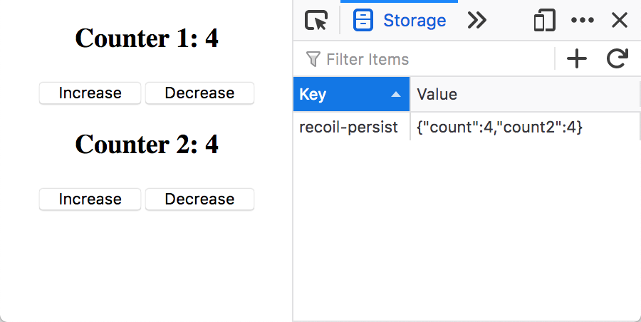

# Recoil Persist

Tiny module for [recoil](https://recoiljs.org) to store and sync state to `localStorage`.


```js
import React from 'react'
import ReactDOM from 'react-dom'
import App from './App'
import { RecoilRoot } from 'recoil'
import recoilPersist from 'recoil-persist'

const { RecoilPersist, updateState } = recoilPersist()

ReactDOM.render(
  <React.StrictMode>
    <RecoilRoot initializeState={updateState}>
      <RecoilPersist />
      <App />
    </RecoilRoot>
  </React.StrictMode>,
  document.getElementById('root'),
)
```

## Install

```
npm install --save-dev recoil-persist
```

or

```
yarn add --dev recoil-persist
```

Now you could add `RecoilPersist` to your app:

```diff
import React from 'react';
import ReactDOM from 'react-dom';
import App from './App';
import { RecoilRoot } from "recoil";
+import recoilPersist from 'recoil-persist'

+const { RecoilPersist, updateState } = recoilPersist()

ReactDOM.render(
  <React.StrictMode>
-   <RecoilRoot>
+   <RecoilRoot initializeState={updateState}> {/* Pass `updateState` function to recoil */}
+      <RecoilPersist /> {/* Please add this line inside `RecoilRoot` scope */}
      <App />
    </RecoilRoot>
  </React.StrictMode>,
  document.getElementById('root')
);
```

To make it work you need to add `persistence_UNSTABLE` key to atom properties:

```diff
const counterState = atom({
  key: "count",
  default: 0,
+  persistence_UNSTABLE: {
+    type: 'count'
+  },
});
```

After this each changes in atoms will be store and sync to `localStorage`.

## Usage

```js
import React from 'react';
import ReactDOM from 'react-dom';
import App from './App';
import { RecoilRoot } from "recoil";
import recoilPersist from 'recoil-persist'

const { RecoilPersist, updateState } = recoilPersist(
    ['count'], // configurate that atoms will be stored (if empty then all atoms will be stored),
    {
        key: 'recoil-persist', // this key is using to store data in local storage
        storage: localStorage // configurate which stroage will be used to store the data
    }
)

ReactDOM.render(
  <React.StrictMode>
   <RecoilRoot initializeState={({set}) => {
       {/* Use `set` for initialize the state */}
       updateState({set}) {/* If the localStorage has stored state then init state will be overide */}
    }>
      <RecoilPersist />
      <App />
    </RecoilRoot>
  </React.StrictMode>,
  document.getElementById('root')
);
```



## API

### recoilPersist(paths, config)

#### paths parameter

```js
type paths = Void | Array<String>
```

If no value is provided to `paths`, then `recoilPersist` stores everything in storage.

#### config parameter

```js
type config.key = String
```

Default value of `config.key` is `recoil-persist`. This key is using to store data in storage.

```js
type config.storage = Storage
```

Set `config.storage` with `sessionStorage` or other `Storage` implementation to change storage target. Otherwise `localStorage` is used (default).

## Notes

This package use unstable hook `useTransactionObservation_UNSTABLE`. 
As far it will be stable the package will be updated with new API.

## Demo

```
$ git clone git@github.com:polemius/recoil-persist.git
$ cd recoil-persist
$ npm install
$ npm run start
```

Please open [localhost:1234](http://localhost:1234).